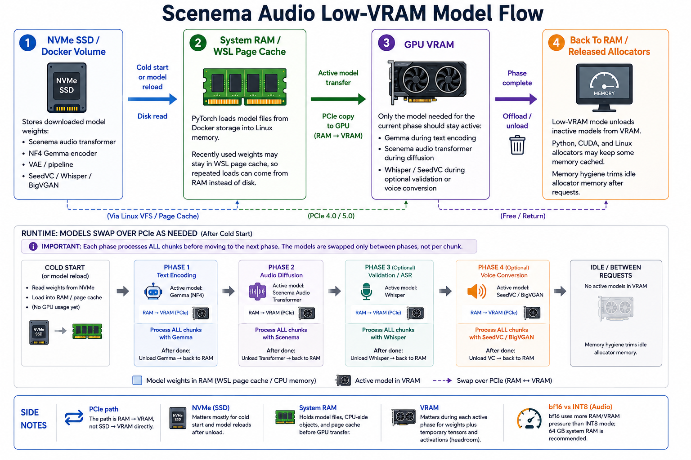

# Scenema Audio Low VRAM Runtime

Run [Scenema Audio](https://huggingface.co/ScenemaAI/scenema-audio) on a 16 GB VRAM NVIDIA GPU with a Windows/WSL Docker setup.

This repo contains runtime code, Docker files, launch scripts, and UI/API improvements. It does not include or redistribute model weights.



## Quick Start

Prerequisites:

- Windows 11, WSL2, Docker Desktop, and NVIDIA Container Toolkit support through Docker Desktop.
- NVIDIA GPU with 16 GB VRAM tested.
- Hugging Face access for the upstream Scenema Audio files.

One command from PowerShell:

```powershell
.\Install-And-Run.ps1
```

Then open:

```text
http://127.0.0.1:8000/ui/
```

Need step-by-step setup? See [LOCAL-RUN.md](LOCAL-RUN.md).

If the script cannot find a Hugging Face token, run `huggingface-cli login` or set:

```powershell
$env:HF_TOKEN = "your_huggingface_token"
.\Install-And-Run.ps1
```

You can also copy [.env.example](.env.example) to `.env` and fill local values. Do not commit `.env`.

Outputs are saved to `./outputs` by default. To use another folder:

```powershell
.\Install-And-Run.ps1 -OutputDir "D:\ScenemaAudioOutputs"
```

## What This Changes

- Uses the INT8 Scenema audio transformer.
- Uses [unsloth/gemma-3-12b-it-bnb-4bit](https://huggingface.co/unsloth/gemma-3-12b-it-bnb-4bit) for the default low-VRAM Gemma encoder.
- Encodes all text chunks first, then unloads Gemma before audio diffusion.
- Keeps large model reads inside Docker/WSL volumes instead of slow Windows bind mounts.
- Adds progress percentage, current stage, elapsed time, and a Stop button to the Gradio UI.
- Adds `GET /progress/{job_id}` and `POST /cancel/{job_id}` API endpoints.
- Saves every successful generation as WAV plus JSON metadata.
- Releases idle model memory after each request.

The default install does not download the full `google/gemma-3-12b-it` checkpoint. Full Gemma comparison is documented as an optional path in [docs/optional-full-gemma.md](docs/optional-full-gemma.md).

The default install also uses the INT8 Scenema audio transformer. The official bf16 audio transformer can be tested separately with [docs/optional-bf16-audio.md](docs/optional-bf16-audio.md). bf16 mode is more memory hungry; 64 GB system RAM is recommended.

## How It Runs On 16 GB VRAM

The low-VRAM path keeps only the model needed for the current phase active:

1. Plan chunks.
2. Load NF4 Gemma.
3. Encode all chunk prompts into conditioning tensors.
4. Unload Gemma.
5. Run Scenema audio diffusion chunk by chunk.
6. Run optional validation, vocal cleanup, and SeedVC.
7. Save output and offload idle models.

Model weights normally move through the machine like this:

```text
disk -> RAM -> VRAM
```

On the first run, files are downloaded from Hugging Face into Docker volumes on disk. During startup or a model phase, PyTorch reads weights from disk into system RAM, then copies the active model to GPU VRAM over PCIe. If the operating system still has recently used model files in page cache, repeated loads can come from RAM cache instead of hitting disk again.

Because this runtime uses `GEMMA_OFFLOAD=unload`, NF4 Gemma is intentionally released after text encoding. That keeps 16 GB VRAM usable for audio diffusion, but the next request may need to load Gemma again. For that reason, an NVMe SSD is strongly recommended for Docker/WSL storage. HDDs and slow SATA SSDs can make model reloads feel like the app is stuck.

Best storage setup:

- Keep Docker Desktop's WSL disk image on an NVMe SSD.
- Keep large model reads in Docker/WSL volumes, not Windows bind mounts on a slow drive.
- Use 64 GB system RAM if possible, so WSL/Linux page cache and CPU offload have room.

Main environment:

```text
GEMMA_REPO=unsloth/gemma-3-12b-it-bnb-4bit
GEMMA_ROOT=/app/models/gemma-3-12b-it-bnb-4bit
GEMMA_QUANTIZE=nf4
GEMMA_OFFLOAD=unload
```

Optional auxiliary offload:

```text
OFFLOAD_AUDIO_BEFORE_AUX=1
```

Default INT8 mode leaves this off unless you enable it in `.env`. bf16 audio mode enables it automatically. When enabled, the runtime offloads Scenema audio models before Gemma text encoding, Whisper validation, and SeedVC. This reduces VRAM pressure around auxiliary phases, but can increase RAM pressure and model reload time.

## Benchmarks

Test system: RTX 4080 SUPER 16 GB, Windows/WSL Docker, seed `120`, `background_sfx=true`, `validate=false`.

| Pair | Mode | Audio duration | Processing time | Peak VRAM |
|---|---:|---:|---:|---:|
| Long prompt | NF4 low-VRAM | 50.34s | 108.36s | 14,488 MB |
| Long prompt | Optional full Gemma | 46.24s | 414.21s | 13,220 MB |
| Short prompt | NF4 low-VRAM | 12.20s | 19.72s | 14,488 MB |
| Short prompt | Optional full Gemma | 10.66s | 194.98s | 8,428 MB |

Takeaway:

- NF4 low-VRAM mode is the practical default for iteration.
- Full Gemma followed prompt context more closely in listening tests, but was much slower.
- Russian stress/pronunciation errors appeared in both modes, so they were not solved by replacing NF4 Gemma with full Gemma.

## Project Files

- [Install-And-Run.ps1](Install-And-Run.ps1) - one-command Windows start for the default low-VRAM mode.
- [Start-ScenemaAudio.ps1](Start-ScenemaAudio.ps1) - compatibility wrapper for `Install-And-Run.ps1`.
- [docker-compose.yml](docker-compose.yml) - base service.
- [docker-compose.override.yml](docker-compose.override.yml) - default low-VRAM NF4 mode.
- [docs/optional-full-gemma.md](docs/optional-full-gemma.md) - optional full Gemma comparison mode.
- [docs/optional-bf16-audio.md](docs/optional-bf16-audio.md) - optional bf16 Scenema audio transformer comparison mode.
- [LOCAL-RUN.md](LOCAL-RUN.md) - short local operations guide.
- [PULL_REQUEST.md](PULL_REQUEST.md) - prepared PR text.
- [.env.example](.env.example) - optional local environment template without secrets.

## API

Progress:

```text
GET /progress/{job_id}
```

Cancel:

```text
POST /cancel/{job_id}
```

Generate:

```text
POST /generate
```

Successful generations return base64 WAV audio and are also saved to `OUTPUT_DIR` inside the container, mounted from the host output directory.

## Notes

- First run downloads large model files into Docker volumes and can take a long time.
- The default low-VRAM mode still needs substantial disk space for Scenema, NF4 Gemma, SeedVC, Whisper, and BigVGAN files.
- NVMe storage is strongly recommended because unloaded models are later read back from Docker/WSL storage into RAM and then VRAM.
- The Stop button is cooperative. It stops between model phases, not in the middle of a CUDA kernel.
- WSL/Docker can keep disk cache visible in `VmmemWSL` after large model reads.
- The runtime trims Python/CUDA allocator memory after requests to reduce RSS growth across repeated generations.
- Optional bf16 audio mode enables extra audio-model offload before Gemma, Whisper, and SeedVC phases.
- This repo does not change model licenses. Model access and use remain governed by each upstream project.

## Credits

This runtime builds on:

- [ScenemaAI/scenema-audio](https://huggingface.co/ScenemaAI/scenema-audio) - original Scenema Audio model and pipeline.
- [ScenemaAI](https://scenema.ai/audio) - project page and demos.
- [Lightricks/LTX-2](https://github.com/Lightricks/LTX-2) - LTX audiovisual components used by Scenema Audio.
- [Google Gemma](https://huggingface.co/google/gemma-3-12b-it) - Gemma 3 12B instruction model family.
- [unsloth/gemma-3-12b-it-bnb-4bit](https://huggingface.co/unsloth/gemma-3-12b-it-bnb-4bit) - default NF4 Gemma checkpoint for low-VRAM mode.
- [Plachtaa/seed-vc](https://github.com/Plachtaa/seed-vc) - SeedVC voice conversion.
- [Kijai/ComfyUI-MelBandRoFormer](https://github.com/kijai/ComfyUI-MelBandRoFormer) and [MelBandRoFormer weights](https://huggingface.co/Kijai/MelBandRoFormer_comfy) - vocal/background separation.
- [NVIDIA BigVGAN](https://huggingface.co/nvidia/bigvgan_v2_22khz_80band_256x) - vocoder used by SeedVC.
- [OpenAI Whisper](https://github.com/openai/whisper) and [faster-whisper](https://github.com/SYSTRAN/faster-whisper) - optional speech validation.
- [Kokoro](https://huggingface.co/hexgrad/Kokoro-82M) - duration estimation for chunk planning.

## License

Code changes are MIT-licensed where applicable, following the upstream repository. Model weights remain under their respective licenses and terms.

## Security Notes

The PowerShell files are plain-text launch helpers for Docker Compose. They are not obfuscated and do not download or execute hidden binaries outside the Docker runtime.

VirusTotal API scan results for the tracked PowerShell scripts on 2026-05-17:

| Script | SHA256 | VirusTotal result |
|---|---|---|
| `Generate-TestAudio.ps1` | `507f59f53fb58ebf40491ca8328fd1b401c8953e707eee1d96b7d252f48d17fc` | 0 malicious / 0 suspicious ([report](https://www.virustotal.com/gui/file/507f59f53fb58ebf40491ca8328fd1b401c8953e707eee1d96b7d252f48d17fc)) |
| `Install-And-Run.ps1` | `1b54bea310b340fe02c4bc389c001746ed4cf124d4527e8c4b49a7fa932080a8` | 0 malicious / 0 suspicious ([report](https://www.virustotal.com/gui/file/1b54bea310b340fe02c4bc389c001746ed4cf124d4527e8c4b49a7fa932080a8)) |
| `Start-ScenemaAudio-BF16Audio.ps1` | `09e281e2ef88e72da7092a38162bcb803474d7717b759593545583368e1076d6` | 0 malicious / 0 suspicious ([report](https://www.virustotal.com/gui/file/09e281e2ef88e72da7092a38162bcb803474d7717b759593545583368e1076d6)) |
| `Start-ScenemaAudio-FullGemma.ps1` | `cc508bf96d46d0f7ac9bbaa94d58f5f6e048fb0a8b2c887372b444e1a0f27c2f` | 0 malicious / 0 suspicious ([report](https://www.virustotal.com/gui/file/cc508bf96d46d0f7ac9bbaa94d58f5f6e048fb0a8b2c887372b444e1a0f27c2f)) |
| `Start-ScenemaAudio.ps1` | `6345bc98078296e030f12d48e1ca484df2a1efcb8c1874ff85e80b000dd121ab` | 0 malicious / 0 suspicious ([report](https://www.virustotal.com/gui/file/6345bc98078296e030f12d48e1ca484df2a1efcb8c1874ff85e80b000dd121ab)) |
| `Stop-ScenemaAudio-BF16Audio.ps1` | `998919de5a75c5602cad38899b927a291378c9b6978b56240aa2f157160ebc47` | 0 malicious / 0 suspicious ([report](https://www.virustotal.com/gui/file/998919de5a75c5602cad38899b927a291378c9b6978b56240aa2f157160ebc47)) |
| `Stop-ScenemaAudio-FullGemma.ps1` | `412e2587db5b2e93b02b31fe60659a2d9f12d9bdbadc9b855f2f34eaaac8f6b5` | 0 malicious / 0 suspicious ([report](https://www.virustotal.com/gui/file/412e2587db5b2e93b02b31fe60659a2d9f12d9bdbadc9b855f2f34eaaac8f6b5)) |

VirusTotal results can change if files are re-analyzed later. Inspect the scripts before running them if your local policy requires it.
